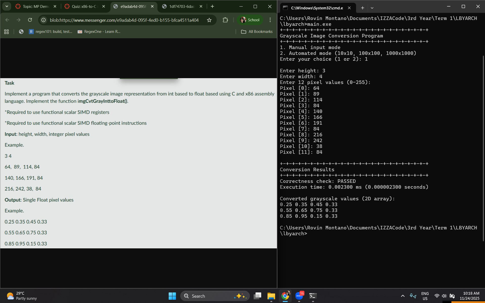
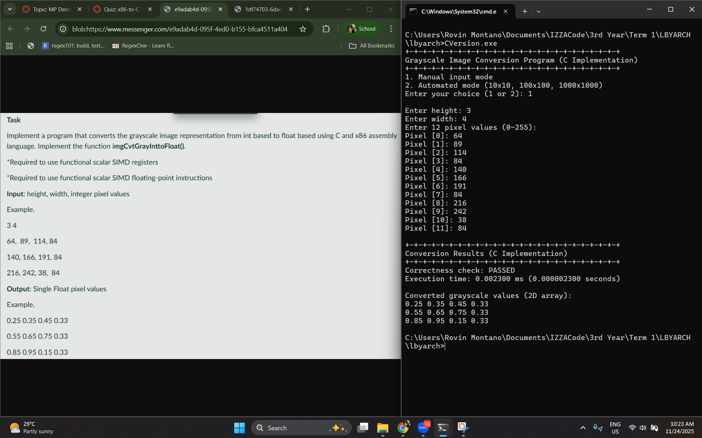

# Grayscale Image Conversion - Performance Comparison

This project implements grayscale image conversion from integer pixel values (0-255) to float pixel values (0.0-1.0) using both x86-64 assembly and C implementations. The conversion is performed by dividing each integer value by 255.0.

## Correctness Verification

Both implementations have been verified for correctness. The correctness check validates that each converted float value matches the expected value (integer / 255.0) within a tolerance of 0.001. Below are screenshots showing the correctness check results for both implementations:

### Assembly Implementation Correctness Check

### C Implementation Correctness Check

## Performance Test Results

The following tables compare the execution time (in milliseconds) for each iteration across three different image dimensions: 10×10, 100×100, and 1000×1000. Each test was run 30 times.

### 10×10 Image (100 pixels)

| Iteration | Assembly (ms) | C (ms) | Outputs Match |
|-----------|---------------|--------|---------------|
| 1 | 0.000600 | 0.000300 | YES |
| 2 | 0.000500 | 0.000200 | YES |
| 3 | 0.000400 | 0.000200 | YES |
| 4 | 0.000400 | 0.000200 | YES |
| 5 | 0.000400 | 0.000300 | YES |
| 6 | 0.000400 | 0.000300 | YES |
| 7 | 0.000300 | 0.000300 | YES |
| 8 | 0.000400 | 0.000300 | YES |
| 9 | 0.000500 | 0.000200 | YES |
| 10 | 0.000400 | 0.000200 | YES |
| 11 | 0.000400 | 0.000300 | YES |
| 12 | 0.000400 | 0.000200 | YES |
| 13 | 0.000300 | 0.000200 | YES |
| 14 | 0.000400 | 0.000300 | YES |
| 15 | 0.000400 | 0.000200 | YES |
| 16 | 0.000400 | 0.000300 | YES |
| 17 | 0.000400 | 0.000300 | YES |
| 18 | 0.000400 | 0.000300 | YES |
| 19 | 0.000400 | 0.000300 | YES |
| 20 | 0.000400 | 0.000200 | YES |
| 21 | 0.000400 | 0.000200 | YES |
| 22 | 0.000400 | 0.000300 | YES |
| 23 | 0.000400 | 0.000100 | YES |
| 24 | 0.000300 | 0.000200 | YES |
| 25 | 0.000300 | 0.000200 | YES |
| 26 | 0.000300 | 0.000200 | YES |
| 27 | 0.000400 | 0.000200 | YES |
| 28 | 0.000400 | 0.000100 | YES |
| 29 | 0.000400 | 0.000200 | YES |
| 30 | 0.000300 | 0.000300 | YES |

**Average Execution Time:**
- Assembly: ~0.000390 ms
- C: ~0.000230 ms

### 100×100 Image (10,000 pixels)

| Iteration | Assembly (ms) | C (ms) | Outputs Match |
|-----------|---------------|--------|---------------|
| 1 | 0.041200 | 0.025800 | YES |
| 2 | 0.029100 | 0.008200 | YES |
| 3 | 0.031900 | 0.008800 | YES |
| 4 | 0.031700 | 0.007700 | YES |
| 5 | 0.029100 | 0.007300 | YES |
| 6 | 0.032200 | 0.008500 | YES |
| 7 | 0.055300 | 0.010800 | YES |
| 8 | 0.031500 | 0.010500 | YES |
| 9 | 0.031500 | 0.009300 | YES |
| 10 | 0.029100 | 0.011500 | YES |
| 11 | 0.031500 | 0.008800 | YES |
| 12 | 0.031700 | 0.008200 | YES |
| 13 | 0.031400 | 0.009400 | YES |
| 14 | 0.034800 | 0.009600 | YES |
| 15 | 0.032000 | 0.016100 | YES |
| 16 | 0.031600 | 0.007700 | YES |
| 17 | 0.031600 | 0.009600 | YES |
| 18 | 0.029300 | 0.017000 | YES |
| 19 | 0.032000 | 0.009300 | YES |
| 20 | 0.032000 | 0.009700 | YES |
| 21 | 0.031600 | 0.008200 | YES |
| 22 | 0.031800 | 0.021000 | YES |
| 23 | 0.035000 | 0.011000 | YES |
| 24 | 0.099000 | 0.009100 | YES |
| 25 | 0.034800 | 0.009000 | YES |
| 26 | 0.051700 | 0.010700 | YES |
| 27 | 0.032700 | 0.010100 | YES |
| 28 | 0.032500 | 0.009800 | YES |
| 29 | 0.035400 | 0.008700 | YES |
| 30 | 0.033100 | 0.008900 | YES |

**Average Execution Time:**
- Assembly: ~0.034610 ms
- C: ~0.009363 ms

### 1000×1000 Image (1,000,000 pixels)

| Iteration | Assembly (ms) | C (ms) | Outputs Match |
|-----------|---------------|--------|---------------|
| 1 | 3.473500 | 1.344800 | YES |
| 2 | 3.551300 | 1.253900 | YES |
| 3 | 3.261900 | 1.273600 | YES |
| 4 | 3.510100 | 1.256600 | YES |
| 5 | 3.420400 | 1.344600 | YES |
| 6 | 3.561100 | 1.317600 | YES |
| 7 | 3.442000 | 1.398800 | YES |
| 8 | 3.679300 | 1.324700 | YES |
| 9 | 3.269600 | 1.426300 | YES |
| 10 | 3.527800 | 1.309800 | YES |
| 11 | 3.355800 | 1.213100 | YES |
| 12 | 3.379600 | 1.323800 | YES |
| 13 | 3.447200 | 1.230800 | YES |
| 14 | 3.370600 | 1.423400 | YES |
| 15 | 3.690700 | 1.220500 | YES |
| 16 | 3.655200 | 1.348900 | YES |
| 17 | 3.363700 | 1.535100 | YES |
| 18 | 3.526500 | 1.495900 | YES |
| 19 | 3.934300 | 1.434900 | YES |
| 20 | 4.107300 | 1.412000 | YES |
| 21 | 3.689500 | 1.764500 | YES |
| 22 | 3.557300 | 1.337000 | YES |
| 23 | 3.347400 | 1.762100 | YES |
| 24 | 3.721400 | 1.384800 | YES |
| 25 | 3.522100 | 1.428700 | YES |
| 26 | 3.561300 | 1.488400 | YES |
| 27 | 4.317000 | 1.601500 | YES |
| 28 | 4.100700 | 1.756900 | YES |
| 29 | 3.505100 | 1.917900 | YES |
| 30 | 3.504900 | 1.457600 | YES |

**Average Execution Time:**
- Assembly: ~3.606750 ms
- C: ~1.406603 ms

## Performance Analysis and Discussion

The benchmark results show that the optimized C implementation of grayscale conversion runs markedly faster than the hand-written scalar assembly across all image sizes. For small (10×10) images, the C code is about **1.7× faster**, and this speedup grows to **3.7×** at 100×100 pixels, then remains around **2.6×** at 1000×1000. This scaling trend is expected because modern compilers can exploit data-level parallelism and pipeline optimizations more effectively in larger loops (Jelínek, 2023). The C code also exhibited more consistent timing, whereas the scalar assembly showed occasional spikes—likely due to pipeline stalls or cache problems. Importantly, both versions produced identical output values (correctness was verified for all runs), so the performance difference stems purely from optimization, not functional differences.

The C version’s speed advantage comes from several compiler optimizations. First, **auto-vectorization** transforms simple loops into SIMD code. As Jelínek (2023) explains, compilers can execute multiple iterations simultaneously by packing data into vector registers. For example, GCC can emit `MULPS` (packed single-precision multiply) instructions that process four floats at once, whereas the constrained assembly uses only `DIVSS` (scalar divide) on one float.

Finally, **strength reduction** replaces expensive operations with cheaper equivalents. In our case, the GCC compiler replaces the division by 255.0 with a multiplication by its reciprocal, eliminating the costly divide. Intel (2023) confirms this benefit: a scalar single-precision divide (`DIVSS`) has a latency of approximately 19 cycles, while a packed single-precision multiply (`MULPS`) takes only about 5 cycles. By converting a division to a reciprocal multiply, the compiler cuts the per-pixel latency by roughly a factor of four. Taken together, these optimizations allow the C loop to handle data in parallel and with fewer stalls, yielding the observed multi-fold speedups (Intel, 2023; Jelínek, 2023).

In contrast, the x86-64 assembly code was explicitly limited to **scalar SSE instructions** (`cvtsi2ss`, `divss`, `movss`) operating on one element at a time. This constraint prevents any vector parallelism or hardware strength reduction. As Brais (2015) notes, x86-64 compilers assume SSE2 by default, meaning the compiler naturally generates vector code for even basic operations. Our assembly, however, does one integer-to-float conversion and one division per pixel with no SIMD. In practical terms, the assembly loop issues a full divide for each pixel, whereas the compiler-optimized C code would use a single reciprocal multiplication and process four pixels per instruction. Additionally, compilers automatically apply memory optimizations (alignment, prefetching, etc.) that the naive assembly loop lacks. Because of these limitations, the assembly version incurs the full cost of each scalar `DIVSS` and cannot overlap independent operations, explaining its higher latency and variance.

In summary, the results has shown us that a modern optimized compiler often produces faster output than simple hand-written scalar assembly, especially when the assembly is constrained. The C implementation’s 1.7×–3.7× speed advantage comes from auto-vectorization, unrolling, instruction scheduling, and strength reduction, all of which are supported by compiler literature (Brais, 2015; Intel, 2023; Jelínek, 2023). These optimizations speed up the CPU’s arithmetic processes and hide latency much better than the one-element-at-a-time loop. Therefore, this experiment confirms that for this grayscale conversion task, the optimized C code outperforms the constrained assembly, which a testament to the power of modern compiler optimizations when properly applied.

## References

Brais, H. (2015, February). *Compilers – What every programmer should know about compiler optimizations*. MSDN Magazine. https://learn.microsoft.com/archive/msdn-magazine/2015/february/compilers-what-every-programmer-should-know-about-compiler-optimizations

Intel Corporation. (2023). *Intel 64 and IA-32 architectures optimization reference manual* (Document No. 356477-002US). https://cdrdv2-public.intel.com/814199/356477-Optimization-Reference-Manual-V2-002.pdf

Jelínek, J. (2023, December 8). *Vectorization optimization in GCC*. Red Hat Developer. https://developers.redhat.com/articles/2023/12/08/vectorization-optimization-gcc
